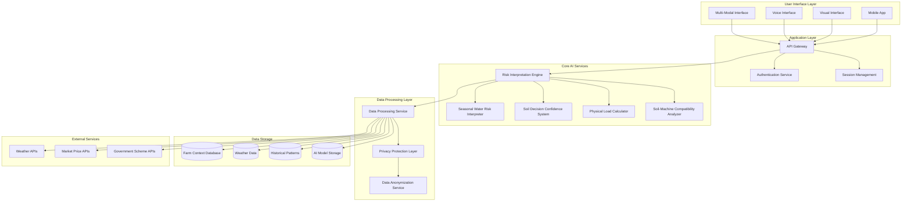

# Design Document: SeasonSaathi

## Overview

SeasonSaathi is an explainable AI-powered contextual risk reduction system that transforms uncertainty into actionable confidence for rural farmers. The system architecture prioritizes transparency, privacy, and farmer autonomy while providing sophisticated risk analysis tailored to individual farm contexts.

The core design philosophy centers on "risk interpretation, not prescription" - the system explains what risks exist and why, but leaves decision-making authority with the farmer. This approach builds trust through transparency while respecting traditional farming knowledge and local expertise.

## Architecture

### Technology Stack

**Backend Services:**
- **Runtime**: Python 3.11+ (for AI/ML capabilities and scientific computing)
- **Web Framework**: FastAPI (for high-performance async APIs)
- **AI/ML Stack**: 
  - Scikit-learn (for traditional ML models)
  - PyTorch (for deep learning models)
  - Pandas/NumPy (for data processing)
  - Hypothesis (for property-based testing)
- **Database**: 
  - PostgreSQL (for structured farm and user data)
  - Redis (for caching and session management)
  - InfluxDB (for time-series weather and sensor data)

**Mobile Application:**
- **Framework**: React Native (cross-platform iOS/Android support)
- **State Management**: Redux Toolkit
- **Offline Storage**: SQLite with Redux Persist
- **Voice Interface**: React Native Voice (with local language support)

**Infrastructure:**
- **Containerization**: Docker + Docker Compose
- **Orchestration**: Kubernetes (for scalable deployment)
- **API Gateway**: Kong or Traefik
- **Message Queue**: Redis/Celery (for async processing)
- **Monitoring**: Prometheus + Grafana
- **Logging**: ELK Stack (Elasticsearch, Logstash, Kibana)

**Data & Privacy:**
- **Data Pipeline**: Apache Airflow (for ETL processes)
- **Privacy Layer**: Custom Python middleware with differential privacy
- **Encryption**: AES-256 for data at rest, TLS 1.3 for data in transit
- **Anonymization**: k-anonymity and l-diversity algorithms

**External Integrations:**
- **Weather APIs**: OpenWeatherMap, India Meteorological Department APIs
- **Market Data**: AGMARKNET APIs, commodity exchange feeds
- **Government Schemes**: Digital India APIs (where available)

**Development & Testing:**
- **Testing**: pytest (unit tests), Hypothesis (property-based testing)
- **Code Quality**: Black (formatting), pylint (linting), mypy (type checking)
- **CI/CD**: GitHub Actions or GitLab CI
- **Documentation**: Sphinx (API docs), MkDocs (user documentation)

**Deployment Considerations:**
- **Cloud**: Multi-cloud support (AWS, Azure, Google Cloud)
- **Edge Computing**: Lightweight models for offline processing
- **CDN**: CloudFlare for static content and API acceleration
- **Backup**: Automated daily backups with point-in-time recovery

### AI-Assisted Development Workflow

The SeasonSaathi development process leverages AI assistance at multiple stages to accelerate development while maintaining quality:

**Code Generation & Implementation:**
- **AI Pair Programming**: Use GitHub Copilot or similar tools for boilerplate code generation
- **API Development**: AI-assisted FastAPI endpoint generation with proper validation
- **Data Model Creation**: AI-generated SQLAlchemy models and Pydantic schemas
- **Test Generation**: Automated unit test and property test scaffolding

**AI Model Development:**
- **Feature Engineering**: AI-assisted feature selection and transformation
- **Model Architecture**: AI-suggested neural network architectures for risk prediction
- **Hyperparameter Tuning**: Automated hyperparameter optimization using Optuna
- **Model Validation**: AI-assisted cross-validation and performance analysis

**Documentation & Explanation:**
- **API Documentation**: Auto-generated OpenAPI specs with AI-enhanced descriptions
- **Code Comments**: AI-generated inline documentation for complex algorithms
- **User Documentation**: AI-assisted creation of farmer-friendly explanations
- **Technical Specifications**: AI-enhanced requirement and design documentation

**Quality Assurance:**
- **Code Review**: AI-assisted code review for security and performance issues
- **Bug Detection**: Static analysis with AI-enhanced pattern recognition
- **Performance Optimization**: AI-suggested optimizations for database queries and algorithms
- **Security Scanning**: AI-powered vulnerability detection and remediation

**Data Processing & Analysis:**
- **Data Cleaning**: AI-assisted identification and correction of data quality issues
- **Pattern Recognition**: AI-enhanced analysis of farming patterns and outcomes
- **Anomaly Detection**: Automated identification of unusual data patterns
- **Synthetic Data Generation**: AI-generated test data for development and testing
- **Synthetic Data Validation Framework**: 
  - Distribution comparison with published agricultural datasets (ICRISAT, ICAR databases)
  - Statistical validation against regional crop yield patterns
  - Cross-validation with government agricultural statistics
  - Farmer expert review of synthetic scenarios for realism
  - Seasonal pattern validation against meteorological data

**Data Collection Strategy:**
- **Multi-Channel Input System**:
  - **Farmer Self-Report**: Mobile app with voice input and simple forms
  - **FPO Digitization**: Farmer Producer Organization data entry partnerships
  - **Village Champions**: Trained local representatives for data collection
  - **Government Integration**: API connections to existing agricultural databases
  - **Crowdsourced Validation**: Peer verification of reported conditions
- **Input Validation Pipeline**:
  - Cross-reference farmer reports with satellite imagery
  - Validate soil conditions against regional soil maps
  - Compare weather reports with meteorological station data
  - Flag inconsistencies for manual review

**Model Optimization & Edge Deployment:**
- **Model Quantization Plan**:
  - **TensorFlow Lite**: Convert risk assessment models for Android deployment
  - **PyTorch Mobile**: Optimize iOS models for offline inference
  - **ONNX Runtime**: Cross-platform model optimization
  - **Model Pruning**: Remove redundant parameters for faster inference
  - **Knowledge Distillation**: Create lightweight student models from complex teachers
- **Edge Computing Architecture**:
  - Core risk models cached locally on mobile devices
  - Periodic model updates via differential sync
  - Fallback to cloud processing for complex scenarios
  - Battery-optimized inference scheduling

**API Resilience & Fallback Systems:**
- **Cached Response Layer**:
  - Redis-based caching of common risk scenarios
  - Pre-computed responses for typical farm contexts
  - Offline-first architecture with sync-when-available
- **Graceful Degradation Strategy**:
  - Weather API failure → Use historical averages + uncertainty indicators
  - Market API failure → Use cached price trends + staleness warnings
  - Government API failure → Provide general scheme information
  - AI model failure → Fall back to rule-based risk assessment
- **Circuit Breaker Pattern**:
  - Automatic failover to backup services
  - Health monitoring of external dependencies
  - Progressive retry with exponential backoff

**Continuous Learning Architecture:**
- **Real-Time Model Updates**:
  - **Federated Learning**: Update models without centralizing farmer data
  - **Incremental Learning**: Adapt models as new data arrives
  - **A/B Testing Framework**: Compare model versions in production
  - **Outcome Tracking**: Monitor prediction accuracy against actual results
- **Data Pipeline for Continuous Learning**:
  ```python
  # Continuous learning pipeline
  class ContinuousLearningPipeline:
      def collect_feedback(self, prediction_id, actual_outcome):
          # Collect farmer-reported outcomes
          pass
      
      def update_model_incrementally(self, new_data_batch):
          # Update model weights without full retraining
          pass
      
      def validate_model_performance(self, holdout_set):
          # Continuous validation against reserved data
          pass
      
      def deploy_model_update(self, validated_model):
          # Gradual rollout of updated models
          pass
  ```
- **Privacy-Preserving Learning**:
  - Differential privacy for model updates
  - Secure aggregation of farmer outcomes
  - Local model personalization without data sharing
- **Model Governance**:
  - Version control for all model iterations
  - Rollback capabilities for problematic updates
  - Performance monitoring and alerting
  - Bias detection and mitigation in model updates

**Deployment & Operations:**
- **Infrastructure as Code**: AI-assisted Kubernetes and Terraform configuration
- **Monitoring Setup**: AI-generated monitoring rules and alerting configurations
- **Performance Tuning**: AI-assisted optimization of system performance
- **Incident Response**: AI-enhanced log analysis and troubleshooting

**Continuous Improvement:**
- **A/B Testing**: AI-assisted experiment design and analysis
- **User Feedback Analysis**: AI-powered sentiment analysis of farmer feedback
- **Model Retraining**: Automated model updates based on new data
- **Feature Prioritization**: AI-assisted analysis of feature usage and impact

**Development Tools Integration:**
```yaml
# Example AI-assisted development pipeline
ai_workflow:
  code_generation:
    - github_copilot: "Real-time code suggestions"
    - tabnine: "AI-powered code completion"
  
  testing:
    - hypothesis: "Property-based test generation"
    - pytest_ai: "Intelligent test case generation"
  
  documentation:
    - sphinx_ai: "Auto-generated API documentation"
    - docstring_ai: "Intelligent code documentation"
  
  deployment:
    - kubernetes_ai: "Intelligent resource allocation"
    - monitoring_ai: "Predictive alerting and scaling"
```

This AI-assisted approach accelerates development while ensuring high code quality, comprehensive testing, and maintainable documentation throughout the SeasonSaathi implementation process.

### Explainable AI Framework

SeasonSaathi's trustworthiness depends on transparent, understandable explanations. The system employs multiple explainability techniques tailored to different user needs and technical contexts:

**Multi-Method Explainability Stack:**

```python
class ExplainabilityEngine:
    def __init__(self):
        self.lime_explainer = LimeExplainer()
        self.shap_explainer = ShapExplainer()
        self.counterfactual_generator = CounterfactualGenerator()
        self.causal_reasoner = CausalReasoningEngine()
    
    def generate_explanation(self, prediction, context, user_profile):
        """Generate multi-layered explanations based on user needs"""
        explanations = {
            'feature_importance': self.shap_explainer.explain(prediction),
            'local_explanation': self.lime_explainer.explain_instance(prediction),
            'counterfactual': self.counterfactual_generator.generate(prediction),
            'causal_chain': self.causal_reasoner.explain_causality(prediction, context),
            'farmer_narrative': self.generate_farmer_story(prediction, context)
        }
        return self.adapt_to_user(explanations, user_profile)
```

**1. SHAP (SHapley Additive exPlanations) - Global Feature Importance**
- **Use Case**: Understanding which factors most influence risk assessments
- **Implementation**: TreeSHAP for ensemble models, DeepSHAP for neural networks
- **Farmer Presentation**: "Your soil type contributes 30% to the risk, rainfall pattern 25%..."
- **Visual Format**: Waterfall charts showing positive/negative contributions

**2. LIME (Local Interpretable Model-agnostic Explanations) - Instance-Specific**
- **Use Case**: Explaining individual risk predictions for specific farm contexts
- **Implementation**: Tabular LIME for structured farm data, Image LIME for satellite imagery
- **Farmer Presentation**: "For your specific farm, changing from chemical to organic reduces risk by 15%"
- **Interactive Format**: "What-if" sliders showing impact of changing practices

**3. Counterfactual Explanations - Alternative Scenarios**
- **Use Case**: Showing farmers how small changes could improve outcomes
- **Implementation**: DiCE (Diverse Counterfactual Explanations) framework
- **Farmer Presentation**: "If you had waited 2 weeks to sow, your risk would be LOW instead of MEDIUM"
- **Decision Support**: Actionable alternatives with minimal changes

**4. Causal Reasoning - Cause-Effect Chains**
- **Use Case**: Explaining the logical chain from conditions to outcomes
- **Implementation**: Causal inference with DoWhy library + domain knowledge graphs
- **Farmer Presentation**: "Heavy rain → waterlogged soil → root rot risk → yield loss"
- **Educational Value**: Builds farming knowledge alongside decision support

**5. Narrative Explanations - Farmer-Friendly Stories**
- **Use Case**: Converting technical explanations into relatable narratives
- **Implementation**: Template-based natural language generation with local context
- **Farmer Presentation**: "Your neighbor Ravi had similar conditions last year and chose early harvest, avoiding the late-season rains"
- **Cultural Adaptation**: Uses local farming terminology and seasonal references

**Explanation Adaptation Framework:**

```python
class ExplanationAdapter:
    def adapt_to_literacy_level(self, explanation, literacy_level):
        if literacy_level == 'low':
            return self.convert_to_voice_narrative(explanation)
        elif literacy_level == 'medium':
            return self.add_visual_icons(explanation)
        else:
            return self.include_technical_details(explanation)
    
    def localize_explanation(self, explanation, region, language):
        return self.translate_and_contextualize(explanation, region, language)
    
    def personalize_explanation(self, explanation, farmer_profile):
        return self.reference_similar_cases(explanation, farmer_profile)
```

**Trust-Building Explanation Features:**

1. **Uncertainty Communication**:
   - Confidence intervals for all predictions
   - "I'm 80% confident in this assessment" statements
   - Clear indication when data is insufficient

2. **Peer Comparison (Privacy-Preserving)**:
   - "Farmers with similar conditions chose X option 70% of the time"
   - Anonymized success/failure patterns
   - Regional trend explanations

3. **Historical Validation**:
   - "This model correctly predicted outcomes for 85% of similar cases last season"
   - Track record transparency
   - Continuous accuracy reporting

4. **Explanation Validation Pipeline**:
   ```python
   class ExplanationValidator:
       def validate_consistency(self, explanation, prediction):
           # Ensure explanations align with predictions
           pass
       
       def check_farmer_comprehension(self, explanation, feedback):
           # Monitor if farmers understand explanations
           pass
       
       def measure_trust_impact(self, explanation_type, farmer_adoption):
           # Track which explanations build most trust
           pass
   ```

**Multi-Modal Explanation Delivery:**

- **Visual**: Charts, icons, color-coded risk levels
- **Audio**: Voice explanations in local languages
- **Interactive**: Touch-based "what-if" scenarios
- **Textual**: Simple, jargon-free written summaries

**Explanation Quality Metrics:**

- **Fidelity**: How accurately explanations represent model behavior
- **Comprehensibility**: Farmer understanding rates (measured via feedback)
- **Actionability**: Percentage of explanations leading to farmer action
- **Trust**: Correlation between explanation quality and system adoption

This comprehensive explainability framework ensures that SeasonSaathi's AI decisions are not just accurate, but trustworthy and actionable for farmers with varying technical backgrounds.



### Service Architecture Principles

1. **Microservices Design**: Each risk analysis component operates as an independent service
2. **Privacy by Design**: All data processing includes mandatory privacy protection layers
3. **Explainability First**: Every AI decision includes reasoning generation
4. **Offline Capability**: Core risk assessment functions work without internet connectivity
5. **Scalable Processing**: Designed to handle village-level to state-level deployment

## Components and Interfaces

### Risk Interpretation Engine

The central orchestrator that coordinates all risk analysis services and maintains the explainability chain.

```typescript
interface RiskInterpretationEngine {
  analyzeRisk(farmContext: FarmContext, query: RiskQuery): Promise<RiskAssessment>
  explainReasoning(assessment: RiskAssessment): ExplanationChain
  compareScenarios(scenarios: Scenario[]): ScenarioComparison
  generateRecommendations(assessment: RiskAssessment): SafetyRecommendations
}

interface RiskAssessment {
  riskLevel: 'LOW' | 'MEDIUM' | 'HIGH'
  confidence: number
  reasoning: string[]
  factors: RiskFactor[]
  timeframe: string
  alternatives: Alternative[]
}
```

### Seasonal Water Risk Interpreter

Specialized service for analyzing rain-related risks and their implications for farming decisions.

```typescript
interface SeasonalWaterRiskInterpreter {
  assessRainRisk(season: Season, location: Location): RainRiskAssessment
  analyzeSowingTiming(rainRisk: RainRiskAssessment, cropType: string): SowingGuidance
  suggestDroughtAlternatives(scenario: DroughtScenario): Alternative[]
  calculateWaterStressRisk(crop: Crop, weather: WeatherPattern): WaterStressRisk
}

interface RainRiskAssessment {
  probabilityOfAdequateRain: number
  criticalPeriods: DateRange[]
  historicalPatterns: HistoricalRainData[]
  explanation: string
  confidenceLevel: number
}
```

### Soil Decision Confidence System

Transforms soil test data into actionable confidence levels with contextual explanations.

```typescript
interface SoilDecisionConfidenceSystem {
  analyzeSoilTest(testResults: SoilTestResults, farmContext: FarmContext): SoilConfidence
  generateFertilizerGuidance(soilAnalysis: SoilConfidence): FertilizerGuidance
  assessLongTermImpact(practices: FarmingPractice[]): LongTermSoilHealth
  buildConfidenceScore(factors: SoilFactor[]): ConfidenceScore
}

interface SoilConfidence {
  confidenceLevel: number
  safeActions: Action[]
  riskyActions: Action[]
  reasoning: string[]
  soilHealthTrend: 'IMPROVING' | 'STABLE' | 'DECLINING'
}
```

### Physical Load Calculator

Evaluates the physical demands of different farming activities and crops.

```typescript
interface PhysicalLoadCalculator {
  calculateCropLoadIndex(crop: Crop, farmingMethod: FarmingMethod): PhysicalLoadIndex
  assessMachineryImpact(machinery: Machinery[], physicalCapacity: PhysicalCapacity): MachineryImpact
  suggestLaborAlternatives(highLoadActivities: Activity[]): LaborAlternative[]
  evaluateSeasonalWorkload(cropPlan: CropPlan): SeasonalWorkload
}

interface PhysicalLoadIndex {
  overallLoad: number
  peakPeriods: WorkloadPeak[]
  criticalActivities: Activity[]
  mitigationOptions: MitigationOption[]
}
```

### Soil-Machine Compatibility Analyzer

Analyzes the compatibility between farming machinery and current soil conditions.

```typescript
interface SoilMachineCompatibilityAnalyzer {
  assessCompatibility(machinery: Machinery, soilCondition: SoilCondition): CompatibilityAssessment
  generateAlerts(incompatibleCombinations: MachineSoilPair[]): Alert[]
  suggestAlternatives(rejectedMachinery: Machinery, soilCondition: SoilCondition): MachineryAlternative[]
  calculateLongTermImpact(machineUsage: MachineUsagePattern, soil: SoilProfile): SoilImpactProjection
}

interface CompatibilityAssessment {
  compatibilityScore: number
  riskFactors: string[]
  safeUsageConditions: UsageCondition[]
  alternatives: MachineryAlternative[]
}
```

### Privacy Protection Layer

Ensures all farmer data is processed with privacy preservation and anonymization.

```typescript
interface PrivacyProtectionLayer {
  anonymizeData(farmerData: FarmerData): AnonymizedData
  aggregateInsights(anonymizedDataSet: AnonymizedData[]): AggregatedInsights
  validatePrivacyCompliance(dataOperation: DataOperation): ComplianceResult
  generatePrivacyReport(dataUsage: DataUsage): PrivacyReport
}

interface AnonymizedData {
  clusterId: string
  generalizedLocation: Region
  cropPatterns: CropPattern[]
  outcomeMetrics: OutcomeMetric[]
  // No personally identifiable information
}
```

## Data Models

### Core Domain Models

```typescript
interface FarmContext {
  farmId: string
  location: Location
  soilHandlingHistory: SoilHandlingRecord[]
  waterBehavior: WaterBehaviorPattern
  inputPhilosophy: 'CHEMICAL' | 'ORGANIC' | 'MIXED'
  laborIntensity: LaborIntensityProfile
  farmSize: number
  cropHistory: CropRecord[]
}

interface SoilHandlingRecord {
  date: Date
  machineryUsed: Machinery[]
  soilCondition: SoilCondition
  impact: SoilImpact
}

interface WaterBehaviorPattern {
  drainageType: 'STANDING' | 'DRAINING' | 'MIXED'
  waterRetention: number
  floodRisk: number
  irrigationAccess: IrrigationAccess
}

interface LaborIntensityProfile {
  availableLabor: number
  physicalCapacity: PhysicalCapacity
  seasonalConstraints: SeasonalConstraint[]
  preferredActivities: Activity[]
}
```

### Risk Assessment Models

```typescript
interface RiskFactor {
  factorType: 'WEATHER' | 'SOIL' | 'MARKET' | 'PHYSICAL' | 'FINANCIAL'
  severity: number
  probability: number
  timeframe: string
  mitigation: MitigationStrategy[]
}

interface Scenario {
  scenarioId: string
  description: string
  assumptions: Assumption[]
  outcomes: ProbabilisticOutcome[]
  riskProfile: RiskProfile
}

interface Alternative {
  alternativeId: string
  description: string
  riskReduction: number
  implementationCost: number
  timeToImplement: number
  suitability: SuitabilityScore
}
```

### Weather and Environmental Models

```typescript
interface WeatherPattern {
  location: Location
  historicalData: WeatherRecord[]
  seasonalTrends: SeasonalTrend[]
  extremeEvents: ExtremeEvent[]
  reliability: number
}

interface Season {
  seasonType: 'KHARIF' | 'RABI' | 'ZAID'
  startDate: Date
  endDate: Date
  criticalPeriods: CriticalPeriod[]
  weatherExpectations: WeatherExpectation[]
}
```

### Machinery and Equipment Models

```typescript
interface Machinery {
  machineryId: string
  type: MachineryType
  soilImpact: SoilImpactProfile
  operatingConditions: OperatingCondition[]
  costProfile: CostProfile
  availability: AvailabilityPattern
}

interface MachineryType {
  category: 'TILLAGE' | 'PLANTING' | 'HARVESTING' | 'IRRIGATION'
  specificType: string
  soilSuitability: SoilType[]
  seasonalRestrictions: SeasonalRestriction[]
}
```

### Market and Economic Models

```typescript
interface MarketCondition {
  crop: string
  currentPrice: number
  priceHistory: PriceRecord[]
  volatility: number
  demandTrends: DemandTrend[]
  storageOptions: StorageOption[]
}

interface CostProfile {
  acquisitionCost: number
  operatingCost: number
  maintenanceCost: number
  sharingOptions: SharingOption[]
  financingOptions: FinancingOption[]
}
```

## Correctness Properties

*A property is a characteristic or behavior that should hold true across all valid executions of a system—essentially, a formal statement about what the system should do. Properties serve as the bridge between human-readable specifications and machine-verifiable correctness guarantees.*

### Property 1: Comprehensive Farm Context Analysis
*For any* farm context data provided to the Risk_Interpreter, the analysis should include all four risk layers (soil handling history, water behavior, input philosophy, and labor intensity) and account for historical machinery usage and farmer-specific physical capabilities.
**Validates: Requirements 1.1, 1.2, 1.3, 1.4, 1.5**

### Property 2: Seasonal Water Risk Completeness
*For any* seasonal risk analysis request, the Seasonal_Water_Risk_Interpreter should provide rain risk assessment, sowing timing implications, crop selection guidance, and drought alternatives that avoid debt-based solutions.
**Validates: Requirements 2.1, 2.2, 2.3**

### Property 3: Safety-First Optimization Priority
*For any* decision scenario where safety/sustainability conflicts with profit maximization, the system should consistently choose the option that prioritizes risk reduction, soil protection, regret minimization, and long-term land health over short-term gains.
**Validates: Requirements 2.5, 3.5, 6.1, 6.5, 10.4**

### Property 4: Soil Decision Confidence Transformation
*For any* soil test data and farm context, the Decision_Confidence_System should transform the input into contextual confidence levels with clear safe action recommendations and soil health prioritization.
**Validates: Requirements 3.1, 3.2, 3.5**

### Property 5: Machinery-Soil Compatibility Assessment
*For any* machinery and soil condition combination, the Soil_Machine_Compatibility_Lens should assess compatibility, generate alerts for harmful practices, and suggest alternatives when incompatibilities are detected.
**Validates: Requirements 4.1, 4.2**

### Property 6: Physical Load and Resource Optimization
*For any* crop selection or tool acquisition scenario, the system should calculate physical load indices and suggest resource-sharing pathways that minimize debt and physical strain.
**Validates: Requirements 4.4, 4.5**

### Property 7: Long-Term Impact Integration
*For any* farming decision (fertilizer usage, machinery selection, input choices), the system should model and visualize multi-season and multi-year sustainability implications, including cumulative soil health impacts.
**Validates: Requirements 3.3, 4.3, 10.1, 10.2, 10.3**

### Property 8: Explainable Risk Classification
*For any* risk assessment generated, the system should use clear LOW/MEDIUM/HIGH classifications, include reasoning explanations, and reference peer outcomes without revealing individual farmer data.
**Validates: Requirements 5.2, 5.3, 5.5**

### Property 9: Post-Harvest Risk Minimization
*For any* post-harvest scenario, the system should analyze market conditions, storage options, and selling timing with a focus on safety over profit, factoring in spoilage risks and storage costs.
**Validates: Requirements 6.2, 6.3, 6.4**

### Property 10: Comprehensive Privacy Protection
*For any* data collection, processing, or sharing operation, the system should limit collection to essential information (crop type, village weather, observations, prices), use anonymized clustering, never reveal individual farmer data, and avoid creating surveillance pathways.
**Validates: Requirements 7.1, 7.2, 7.3, 7.4, 7.5**

### Property 11: Multi-Modal Interface Accessibility
*For any* information display, the system should include both visual elements (graphics and icons) and text, ensuring accessibility across different literacy levels and device capabilities.
**Validates: Requirements 8.2**

### Property 12: Critical Decision Moment Support
*For any* critical farming decision moment (pre-sowing, mid-season fertilizer, harvest selling), the system should provide timely, relevant risk analysis focused on confidence building rather than directive advice.
**Validates: Requirements 9.1, 9.2, 9.3, 9.4, 9.5**

### Property 13: Holistic Resilience Calculation
*For any* resilience metric calculation, the system should include land health, animal welfare, and farmer well-being indicators to provide comprehensive sustainability assessment.
**Validates: Requirements 10.5**

## Error Handling

### Input Validation and Sanitization

The system implements comprehensive input validation to handle the diverse and potentially inconsistent data from rural farming contexts:

```typescript
interface InputValidator {
  validateFarmContext(context: FarmContext): ValidationResult
  sanitizeWeatherData(data: WeatherData): SanitizedWeatherData
  validateSoilTestResults(results: SoilTestResults): ValidationResult
  normalizeUserInput(input: UserInput): NormalizedInput
}
```

**Error Handling Strategies:**

1. **Graceful Degradation**: When complete data is unavailable, the system provides partial analysis with clear confidence indicators
2. **Data Quality Indicators**: All outputs include data quality scores and uncertainty bounds
3. **Fallback Mechanisms**: Regional averages and historical patterns serve as fallbacks for missing farm-specific data
4. **User-Friendly Error Messages**: Technical errors are translated into farmer-understandable language

### Connectivity and Offline Handling

The system is designed to function in areas with poor internet connectivity:

```typescript
interface OfflineCapability {
  cacheEssentialData(farmContext: FarmContext): CachedData
  performOfflineRiskAssessment(cachedData: CachedData, query: RiskQuery): OfflineRiskAssessment
  syncWhenOnline(offlineResults: OfflineResult[]): SyncResult
  prioritizeDataSync(pendingData: PendingData[]): SyncPriority[]
}
```

**Offline Features:**
- Core risk assessment algorithms cached locally
- Historical weather patterns stored on device
- Basic soil analysis capabilities available offline
- Automatic sync when connectivity is restored

### AI Model Reliability and Uncertainty

The system acknowledges and communicates AI uncertainty:

```typescript
interface UncertaintyHandling {
  calculateConfidenceIntervals(prediction: Prediction): ConfidenceInterval
  identifyLowConfidenceScenarios(assessment: RiskAssessment): LowConfidenceFlag[]
  recommendHumanConsultation(uncertaintyLevel: number): ConsultationRecommendation
  trackModelPerformance(predictions: Prediction[], outcomes: Outcome[]): PerformanceMetrics
}
```

**Uncertainty Communication:**
- Clear confidence levels for all predictions
- Explicit acknowledgment when data is insufficient
- Recommendations for seeking additional expert advice
- Transparent model limitations and assumptions

## Testing Strategy

### Dual Testing Approach

The SeasonSaathi system requires both unit testing and property-based testing to ensure comprehensive coverage and correctness:

**Unit Testing Focus:**
- Specific examples of risk scenarios with known outcomes
- Edge cases in weather pattern analysis
- Integration points between AI services
- Error conditions and fallback mechanisms
- Offline functionality validation
- Privacy protection mechanisms

**Property-Based Testing Focus:**
- Universal properties that hold across all farm contexts
- Risk assessment consistency across input variations
- Privacy preservation across all data operations
- Optimization priority verification across decision scenarios
- Comprehensive input coverage through randomization

### Property-Based Testing Configuration

The system uses **Hypothesis** (Python) for property-based testing with the following configuration:
- Minimum 100 iterations per property test
- Each property test references its design document property
- Tag format: **Feature: season-saathi, Property {number}: {property_text}**

**Example Property Test Structure:**
```python
@given(farm_context=farm_context_strategy(), risk_query=risk_query_strategy())
@settings(max_examples=100)
def test_comprehensive_farm_context_analysis(farm_context, risk_query):
    """Feature: season-saathi, Property 1: Comprehensive Farm Context Analysis"""
    result = risk_interpreter.analyze_risk(farm_context, risk_query)
    
    # Verify all four risk layers are analyzed
    assert has_soil_handling_analysis(result)
    assert has_water_behavior_analysis(result)
    assert has_input_philosophy_analysis(result)
    assert has_labor_intensity_analysis(result)
    
    # Verify historical machinery is considered
    assert considers_machinery_history(result, farm_context.soil_handling_history)
```

### Integration Testing Strategy

**Multi-Service Integration:**
- End-to-end risk assessment workflows
- Data flow between privacy layer and AI services
- Offline-to-online synchronization processes
- Multi-modal interface consistency

**Performance Testing:**
- Response time under varying data loads
- Offline capability performance
- Concurrent user handling
- Memory usage optimization

### User Acceptance Testing Approach

**Field Testing Protocol:**
- Pilot deployments in select villages
- Farmer feedback collection on explanation clarity
- Accuracy validation against actual farming outcomes
- Usability testing across different literacy levels

**Continuous Improvement:**
- Model performance monitoring in production
- Farmer outcome tracking (with privacy protection)
- Regular model retraining with new data
- Explanation quality assessment and refinement

The testing strategy ensures that SeasonSaathi not only functions correctly from a technical perspective but also delivers meaningful value to farmers while maintaining their trust through transparent, explainable AI operations.